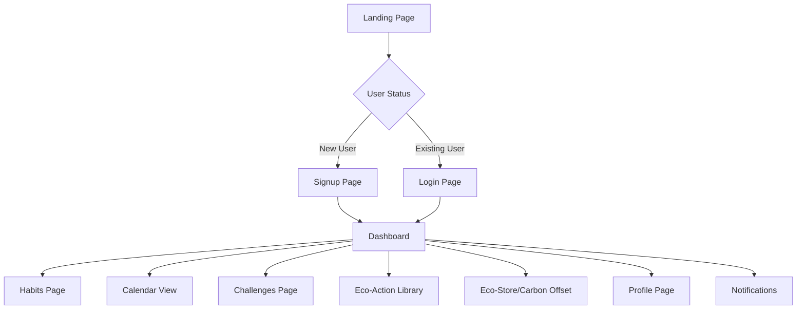

# 🌱 Green Routine Builder

> **A Web-based Sustainable Habit Tracker for Building Eco-Friendly Routines**

[](https://opensource.org/licenses/MIT)
[](https://reactjs.org/)
[](https://nodejs.org/)
[](https://www.mongodb.com/)

---

## 📋 Table of Contents

- [Overview](#-overview)
- [Problem Statement](#-problem-statement)
- [Solution Approach](#-solution-approach)
- [System Architecture](#-system-architecture)
- [Features](#-features)
- [Tech Stack](#-tech-stack)
- [Database Structure](#-database-structure)
- [Project Structure](#-project-structure)
- [Installation](#-installation)
- [Configuration](#-configuration)
- [Running the Application](#-running-the-application)
- [Deployment](#-deployment)
- [UI Workflow](#-ui-workflow)
- [Screenshots](#-screenshots)
- [Contributing](#-contributing)
- [License](#-license)
- [Credits](#-credits)

---

## 🌍 Overview

**Green Routine Builder** is a web-based sustainable habit tracker designed to help users adopt and maintain eco-friendly behaviors through gamification, motivation, and smart tracking.

### Key Highlights

- **Domain:** Sustainability, Smart Systems (Software-only, no IoT)
- **Purpose:** Empower users to create, track, and sustain green habits
- **Approach:** Gamified web platform with streaks, challenges, and eco-actions

---

## 🚨 Problem Statement

People want to adopt eco-friendly behaviors such as:

- ♻️ Reducing plastic usage
- 💧 Saving water
- ⚡ Conserving energy
- 🗑️ Segregating waste

### The Challenge

However, they struggle to **form and sustain** these habits due to:

1. **Complex Tools:** Existing platforms are overly complicated
2. **IoT Dependencies:** Many solutions require hardware/IoT devices
3. **Lack of Motivation:** No engaging features to keep users committed
4. **No Integrated Platform:** Missing a simple, software-only solution with:
   - ⏰ Reminders
   - 🔥 Streaks
   - 🏆 Challenges
   - 📅 Calendar visualization
   - 📚 Eco-action library
   - 📊 Past-week comparison
   - 🌳 Carbon-offset information

**Green Routine Builder** solves these problems through a clean, gamified, web-based habit-building platform.

---

## 💡 Solution Approach

Our solution leverages modern web technologies to create a seamless, motivational experience:

| Component | Technology |
|-----------|-----------|
| **Frontend** | React + Vite + Tailwind CSS |
| **Backend** | Node.js + Express.js |
| **Database** | MongoDB Atlas + Mongoose |
| **Authentication** | JWT (Access + Refresh Tokens) + Bcrypt |
| **Notifications** | Nodemailer (Email) + Browser Push (optional) |
| **Features** | Streak tracking, Badges, Challenges, Calendar, Eco-library |
| **Analytics** | Past-week comparison (rule-based) |
| **Information** | Carbon offset guide |

---

## 🏗️ System Architecture

```
+--------------+       HTTPS        +----------------+        +-------------+
|   Frontend   | <----------------> |  Backend API   | <----> |  Database   |
| (React/Vite) |                    | (Node/Express) |        | (MongoDB)   |
+--------------+                    +----------------+        +-------------+
      |                                       |
      | push / notifications                  | email/sendgrid
      | (FCM or browser)                      |
      v                                       v
+--------------+                       +----------------+
|  Browser PW  |                       |  Notification  |
|  Notifications|                       |  Service/Queue |
+--------------+                       +----------------+
                                             |
                                             v
                                      +---------------+
                                      | Cron / Worker |
                                      | (Reminders)   |
                                      +---------------+
```

### Architecture Components

1. **Frontend (React/Vite):**
   - User interface with Tailwind CSS
   - Fast build tooling with Vite
   - Browser push notifications

2. **Backend API (Node.js/Express):**
   - RESTful API endpoints
   - JWT-based authentication
   - Business logic & validation
   - Email notification service

3. **Database (MongoDB Atlas):**
   - NoSQL document store
   - Mongoose ODM for schema modeling
   - Scalable cloud infrastructure

4. **Notification System:**
   - Email reminders via Nodemailer
   - Push notifications via FCM
   - Scheduled cron jobs for reminders

---

## ✨ Features

### Core Features

| Feature | Description |
|---------|-------------|
| 🔐 **User Authentication** | Secure JWT-based auth with access & refresh tokens |
| ✅ **Habit Creation** | Create custom eco-habits with categories and frequency |
| 📝 **Daily Check-in** | Mark habits as complete with one click |
| 🔥 **Streaks & Badges** | Earn badges (5, 15, 30, 60 days) and maintain streaks |
| 🌟 **EcoScore** | Track your cumulative environmental impact |
| 📅 **Calendar View** | Color-coded calendar (🟩🟨🟥) showing habit completion |
| 📊 **Past-Week Comparison** | Compare with your past performance (no ML) |
| ✉️ **Email Reminders** | Scheduled notifications to stay on track |

### Advanced Features

| Feature | Description |
|---------|-------------|
| 🏆 **Eco Challenges** | Join community challenges and compete with friends |
| 📚 **Eco-Action Library** | Browse curated sustainable living tips |
| 🌳 **Carbon Offset Info** | Learn about carbon footprint reduction |
| 🔔 **Smart Notifications** | Streak warnings and challenge progress alerts |
| 📈 **Challenge Progress** | Track your performance in active challenges |

---

## 🛠️ Tech Stack

### Frontend

```json
{
  "framework": "React 18+",
  "build-tool": "Vite",
  "styling": "Tailwind CSS",
  "routing": "React Router",
  "charts": "Recharts",
  "http-client": "Axios",
  "state-management": "React Context / Hooks"
}
```

### Backend

```json
{
  "runtime": "Node.js 18+",
  "framework": "Express.js",
  "database": "MongoDB Atlas",
  "odm": "Mongoose",
  "authentication": "JWT (jsonwebtoken)",
  "password-hashing": "Bcrypt",
  "email": "Nodemailer",
  "scheduling": "node-cron",
  "validation": "express-validator"
}
```

---

## 🗄️ Database Structure

### MongoDB Collections (Mongoose Schemas)

#### **users**

```javascript
{
  _id: ObjectId,
  name: String,
  email: String,
  password: String, // hashed with bcrypt
  settings: {
    timezone: String,
    emailReminders: Boolean
  },
  ecoScoreTotal: Number,
  createdAt: Date,
  updatedAt: Date
}
```

#### **habits**

```javascript
{
  _id: ObjectId,
  userId: ObjectId, // reference to users
  title: String,
  category: String, // water, energy, waste, plastic, travel
  frequency: String, // daily, weekly, custom
  reminderTime: String, // HH:mm format
  impactLevel: String, // low, medium, high
  archived: Boolean,
  createdAt: Date
}
```

#### **habitLogs**

```javascript
{
  _id: ObjectId,
  userId: ObjectId,
  habitId: ObjectId,
  date: String, // YYYY-MM-DD
  status: String, // done, missed
  createdAt: Date
}
```

#### **challenges**

```javascript
{
  _id: ObjectId,
  title: String,
  description: String,
  durationDays: Number,
  startDate: String,
  endDate: String,
  participants: [ObjectId], // array of user IDs
  createdAt: Date
}
```

#### **challengeProgress**

```javascript
{
  _id: ObjectId,
  userId: ObjectId,
  challengeId: ObjectId,
  completedDays: Number,
  lastUpdated: Date
}
```

#### **ecoActions** (Static Tips Library)

```javascript
{
  _id: ObjectId,
  title: String,
  category: String,
  description: String,
  impactLevel: String,
  impactTips: String
}
```

#### **badges**

```javascript
{
  _id: ObjectId,
  userId: ObjectId,
  type: String, // streak-5, streak-15, streak-30, streak-60, challenge-winner
  value: Number,
  awardedAt: Date
}
```

#### **notifications**

```javascript
{
  _id: ObjectId,
  userId: ObjectId,
  type: String, // reminder, streak-warning, challenge-update
  payload: Object,
  sentAt: Date,
  status: String // sent, pending, failed
}
```

---

## 📁 Project Structure

```
green-routine-builder/
├─ README.md
├─ LICENSE
├─ package.json
├─ .env.example
├─ .gitignore
│
├─ /frontend
│   ├─ index.html
│   ├─ package.json
│   ├─ vite.config.js
│   ├─ tailwind.config.js
│   ├─ postcss.config.js
│   ├─ /public
│   │   └─ /images
│   └─ /src
│       ├─ main.jsx
│       ├─ App.jsx
│       ├─ index.css
│       ├─ /pages
│       │   ├─ Landing.jsx
│       │   ├─ Dashboard.jsx
│       │   ├─ Habits.jsx
│       │   ├─ Calendar.jsx
│       │   ├─ Challenges.jsx
│       │   ├─ Library.jsx
│       │   ├─ EcoStore.jsx
│       │   ├─ Profile.jsx
│       │   └─ Notifications.jsx
│       ├─ /auth
│       │   ├─ Login.jsx
│       │   └─ Signup.jsx
│       ├─ /components
│       │   ├─ Navbar.jsx
│       │   ├─ Sidebar.jsx
│       │   ├─ HabitCard.jsx
│       │   ├─ CalendarGrid.jsx
│       │   ├─ ChallengeCard.jsx
│       │   ├─ ActionCard.jsx
│       │   └─ NotificationBell.jsx
│       ├─ /utils
│       │   ├─ api.js
│       │   └─ helpers.js
│       ├─ /hooks
│       │   └─ useAuth.js
│       ├─ /layout
│       │   └─ MainLayout.jsx
│       └─ /router
│           └─ AppRouter.jsx
│
├─ /backend
│   ├─ package.json
│   ├─ server.js                  # Entry point
│   ├─ /routes
│   │   ├─ authRoutes.js
│   │   ├─ habitRoutes.js
│   │   ├─ challengeRoutes.js
│   │   └─ notificationRoutes.js
│   ├─ /controllers
│   │   ├─ authController.js
│   │   ├─ habitController.js
│   │   ├─ challengeController.js
│   │   └─ notificationController.js
│   ├─ /services
│   │   ├─ emailService.js
│   │   ├─ streakService.js
│   │   └─ badgeService.js
│   ├─ /models
│   │   ├─ User.js
│   │   ├─ Habit.js
│   │   ├─ HabitLog.js
│   │   ├─ Challenge.js
│   │   ├─ ChallengeProgress.js
│   │   ├─ Badge.js
│   │   └─ Notification.js
│   ├─ /jobs
│   │   └─ reminderCron.js        # Scheduled tasks
│   ├─ /middleware
│   │   ├─ authMiddleware.js
│   │   └─ validationMiddleware.js
│   └─ /config
│       ├─ database.js            # MongoDB connection
│       └─ email.js
│
├─ /docs
│   ├─ API.md                     # API documentation
│   ├─ ARCHITECTURE.md            # Architecture details
│   └─ DEPLOYMENT.md              # Deployment guide
│
└─ /deploy
    ├─ Dockerfile
    └─ docker-compose.yml
```

---

## 🚀 Installation

### Prerequisites

Ensure you have the following installed:

- **Node.js** (v18 or higher)
- **npm** or **yarn**
- **MongoDB Atlas Account** (free tier available)
- **Git**

### Clone the Repository

```bash
git clone https://github.com/Bharath-prg/BIT-GREEN-ROUTINE-BUILDER.git
cd BIT-GREEN-ROUTINE-BUILDER
```

### Install Dependencies

#### Install Root Dependencies (if any)

```bash
npm install
```

#### Install Frontend Dependencies

```bash
cd frontend
npm install
```

#### Install Backend Dependencies

```bash
cd ../backend
npm install
```

---

## ⚙️ Configuration

### Environment Variables

Create `.env` files in both frontend and backend directories.

#### **Backend `.env`**

Create `backend/.env`:

```env
# Server Configuration
PORT=5000
NODE_ENV=development

# Firebase Configuration
FIREBASE_PROJECT_ID=your-project-id
FIREBASE_PRIVATE_KEY=your-private-key
FIREBASE_CLIENT_EMAIL=your-client-email

# Email Configuration (Nodemailer)
EMAIL_HOST=smtp.gmail.com
EMAIL_PORT=587
EMAIL_USER=your-email@gmail.com
EMAIL_PASSWORD=your-app-password

# Frontend URL (for CORS)
FRONTEND_URL=http://localhost:3000

# JWT Secret (optional, if using custom tokens)
JWT_SECRET=your-jwt-secret-key
```

#### **Frontend `.env`**

Create `frontend/.env`:

```env
# API Configuration
VITE_API_URL=http://localhost:5000/api
VITE_APP_NAME=Green Routine Builder
```

### MongoDB Atlas Setup

1. Go to [MongoDB Atlas](https://www.mongodb.com/cloud/atlas)
2. Create a free account and cluster
3. Create a database user with password
4. Whitelist your IP address (or use 0.0.0.0/0 for development)
5. Get your connection string
6. Replace `<username>` and `<password>` in the connection string
7. Add the connection string to `backend/.env`

---

## 🎯 Running the Application

### Development Mode

#### Run Backend Server

```bash
cd backend
npm run dev
```

The backend will start at `http://localhost:5000`

#### Run Frontend Development Server

```bash
cd frontend
npm run dev
```

The frontend will start at `http://localhost:5173` (Vite default port)

### Production Mode

#### Build Frontend

```bash
cd frontend
npm run build
npm start
```

#### Run Backend in Production

```bash
cd backend
npm start
```

---

## 🌐 Deployment

### Frontend Deployment (Vercel)

1. Install Vercel CLI:

```bash
npm install -g vercel
```

2. Deploy frontend:

```bash
cd frontend
vercel
```

3. Add environment variables in Vercel dashboard

### Backend Deployment (Railway/Render/Heroku)

#### Using Railway

1. Install Railway CLI:

```bash
npm install -g @railway/cli
```

2. Login and deploy:

```bash
cd backend
railway login
railway init
railway up
```

#### Using Render

1. Connect your GitHub repository
2. Create a new Web Service
3. Set build command: `npm install`
4. Set start command: `npm start`
5. Add environment variables

#### Using Docker

Build and run using Docker:

```bash
# Build
docker-compose build

# Run
docker-compose up -d
```

---

## 🖥️ UI Workflow

### Application Pages



### Page Descriptions

| Page | Route | Description |
|------|-------|-------------|
| **Landing** | `/` | Marketing page with features and CTA |
| **Signup** | `/auth/signup` | User registration with email/password |
| **Login** | `/auth/login` | User authentication |
| **Dashboard** | `/dashboard` | Overview with stats, streaks, quick actions |
| **Habits** | `/habits` | Create, edit, delete, and track habits |
| **Calendar** | `/calendar` | Visual calendar showing habit completion |
| **Challenges** | `/challenges` | Browse and join eco-challenges |
| **Eco-Library** | `/library` | Browse curated eco-action tips |
| **Eco-Store** | `/eco-store` | Carbon offset information and resources |
| **Profile** | `/profile` | User settings, preferences, badges |
| **Notifications** | `/notifications` | View all notifications and reminders |

---

## 📸 Screenshots

> **Coming Soon!** Screenshots will be added once the UI is finalized.

### Planned Screenshots

- [ ] Landing Page
- [ ] Dashboard Overview
- [ ] Habit Creation Flow
- [ ] Calendar View
- [ ] Challenge Details
- [ ] Eco-Action Library
- [ ] Mobile Responsive Views

---

## 🤝 Contributing

We welcome contributions! Please follow these steps:

1. **Fork the repository**
2. **Create a feature branch**

```bash
git checkout -b feature/amazing-feature
```

3. **Commit your changes**

```bash
git commit -m "Add amazing feature"
```

4. **Push to the branch**

```bash
git push origin feature/amazing-feature
```

5. **Open a Pull Request**

### Code Style

- Follow ESLint configuration
- Use Prettier for formatting
- Write meaningful commit messages
- Add comments for complex logic

---

## 📄 License

This project is licensed under the **MIT License** - see the [LICENSE](LICENSE) file for details.

---

## 🙏 Credits

### Developed By

**Bharath PR**  
GitHub: [@Bharath-prg](https://github.com/Bharath-prg)

### Built With

- [React](https://reactjs.org/) - Frontend library
- [Vite](https://vitejs.dev/) - Build tool and dev server
- [Tailwind CSS](https://tailwindcss.com/) - Utility-first CSS framework
- [Node.js](https://nodejs.org/) - Backend runtime
- [Express.js](https://expressjs.com/) - Backend framework
- [MongoDB Atlas](https://www.mongodb.com/cloud/atlas) - Cloud database
- [Mongoose](https://mongoosejs.com/) - MongoDB ODM
- [JWT](https://jwt.io/) - Token-based authentication
- [Bcrypt](https://www.npmjs.com/package/bcrypt) - Password hashing
- [Nodemailer](https://nodemailer.com/) - Email service
- [Recharts](https://recharts.org/) - Charting library

### Inspiration

This project was created to promote sustainable living and help individuals make a positive environmental impact through daily habit tracking.

---

## 📞 Contact & Support

- **Issues:** [GitHub Issues](https://github.com/Bharath-prg/BIT-GREEN-ROUTINE-BUILDER/issues)
- **Discussions:** [GitHub Discussions](https://github.com/Bharath-prg/BIT-GREEN-ROUTINE-BUILDER/discussions)

---

<div align="center">

### ⭐ Star this repository if you find it helpful!

**Made with 💚 for a sustainable future**

</div>

A green routine builder application for BIT.

## Project Structure

This project is organized into two main folders:

- **`/backend`** - Contains the server-side code, API endpoints, and business logic
- **`/frontend`** - Contains the client-side code, UI components, and user interface

Each folder has its own README with more specific information about setup and development.

## Getting Started

Please refer to the README files in the respective folders for setup instructions:
- [Backend README](./backend/README.md)
- [Frontend README](./frontend/README.md)